# Invention Disclosure Form (IDF)
## Enterprise PACS + DICOM Medical Imaging System

**Document Type:** Invention Disclosure Form (IDF)
**Prepared By:** Medical Imaging Software Architecture Team
**Date:** 2026-07-31
**Classification:** Confidential – Internal Use Only

---

> [!NOTE]
> This document is written for a broad audience, including IDF Managers, R&D leads, patent reviewers, and technical engineers. Every technical term is explained in plain language before a detailed explanation is given. No prior knowledge of medical imaging, AI, or PACS systems is assumed.

---

## Table of Contents

1. [Question 1 – Complete Imaging Workflow: Acquisition to Report Generation](#question-1)
2. [Question 2 – 3D Annotation on Smaller Screens and 2D-to-3D Conversion](#question-2)
3. [Question 3 – Segmentation: Methods, AI, and Innovation](#question-3)
4. [Question 4 – The Role of AI in the System](#question-4)
5. [Question 5 – Secure Sharable Study Link Feature](#question-5)

---

<a name="question-1"></a>
# Question 1
## Complete Imaging Workflow: From Image Acquisition to Report Generation

---

## 1. Overview

### What Is This?

When a patient goes to a hospital for a scan — such as an X-ray, CT scan, or MRI — a long and carefully coordinated chain of events takes place inside the hospital's software systems. This chain starts the moment the scanning machine takes a picture, and ends when the radiologist (the doctor who reads medical images) writes and stores a final medical report.

This question explains **every step in that chain**, from beginning to end.

### Why Is It Needed?

Without a structured, automated workflow:
- Images could get lost or mixed up between patients.
- Doctors might have to wait hours for images to arrive on their workstation.
- Reports could be incorrectly filed or sent to the wrong patient record.
- Radiologists would have no AI assistance, slowing diagnosis.

Our system solves all of these problems by creating a fully connected, semi-automated pipeline.

### Where Is It Used?

This workflow is the **backbone of every hospital radiology department**. It operates across:
- The **scanning room** (where images are created)
- The **PACS server** (where images are stored — more on PACS below)
- The **radiology workstation** (where doctors view images)
- The **AI engine** (where computers assist in finding problems)
- The **reporting system** (where doctors write and save their findings)

---

## 2. What Is Happening?

### Simple Explanation

Imagine you go to a hospital and get an MRI scan. Here is what happens next, in simple terms:

1. The MRI machine takes hundreds of pictures of your body — like slices of bread in a loaf.
2. These pictures are converted into a special medical file format called **DICOM** (explained below).
3. The DICOM files are sent over the hospital network to a **digital library** called **PACS**.
4. A radiologist at their computer calls up your images. They appear instantly on a high-resolution screen.
5. An **AI system** quietly scans your images in the background, looking for anything unusual.
6. The radiologist views the images, measures things, draws notes (annotations), and reviews the AI's suggestions.
7. Finally, they write a report — their medical findings — which is saved and sent to the referring doctor.

### Key Terms Explained

| Term | Simple Meaning |
|------|----------------|
| **DICOM** | "Digital Imaging and Communications in Medicine" — the universal file format used for all medical images, like a `.jpg` but specifically designed for medical use, containing both the image AND the patient's information. |
| **PACS** | "Picture Archiving and Communication System" — the hospital's digital library that stores, organizes, and delivers medical images to doctors. Think of it like a cloud photo album, but for hospitals. |
| **Radiologist** | A specialized doctor who is trained to read and interpret medical scans. They do not usually see the patient directly — they study the images. |
| **Modality** | A type of scanning machine. Examples include CT (Computed Tomography), MRI (Magnetic Resonance Imaging), X-ray, and Ultrasound. |
| **Worklist** | A digital to-do list for radiologists, showing which patient's scans need to be reviewed. |
| **RIS** | "Radiology Information System" — the hospital software that manages appointments, orders, and patient records specifically for radiology. |
| **HIS/EMR** | "Hospital Information System / Electronic Medical Record" — the overall hospital patient database. |

---

## 3. How Is It Happening?

### Step-by-Step Breakdown

#### Step 1 — The Scan Order Is Created

Before any image is taken, a doctor (e.g., a surgeon or GP) orders a scan for the patient. This order is entered into the **Hospital Information System (HIS)** or **Electronic Medical Record (EMR)**.

The order travels from the HIS to the **RIS (Radiology Information System)**, which registers the patient for their scheduled scan.

The RIS then sends a **Modality Worklist** entry to the scanning machine. This is like sending a task card to the machine that says: *"Patient John Doe, born 1978, is coming for a chest CT. Please get ready."*

#### Step 2 — Image Acquisition (The Scan Happens)

The patient goes to the scanning room. The machine (e.g., a CT scanner) takes the images. These are raw, digital pictures of the inside of the patient's body.

For a CT scan:
- The machine rotates around the patient and takes X-ray images at many different angles.
- These are combined by the machine's built-in computer into hundreds of thin cross-sectional "slice" images.

For an MRI:
- The machine uses powerful magnetic fields and radio waves to create images of soft tissue.
- Again, the output is a series of slice images.

#### Step 3 — DICOM Image Creation

As soon as the scan is complete, the machine's software automatically packages every image into the **DICOM format**.

Each DICOM file contains two parts:
1. **The Pixel Data** — the actual image (what you see on screen).
2. **The Header** — metadata about the image, including patient name, patient ID, date of scan, the hospital, the machine used, slice thickness, orientation, and many more technical details.

This metadata is critically important — it is what links the image to the correct patient record and allows the image to be correctly displayed.

> [!IMPORTANT]
> A single CT scan can produce anywhere from 100 to over 2,000 individual DICOM slice files. Our system must efficiently manage all of them.

#### Step 4 — DICOM Transfer to PACS (Image Storage)

The scanning machine sends the DICOM files over the hospital's internal network to the **PACS server** using a protocol called **DICOM C-STORE**. Think of this as the machine emailing the images to the hospital's central library.

The PACS server:
1. Receives every DICOM file.
2. Checks that all files arrived correctly (error checking).
3. Stores them in a structured database, organized by Patient → Study → Series → Image.
4. Indexes them so they can be quickly searched and retrieved later.
5. Sends a confirmation back to the scanning machine.

Our system adds a key innovation here: **real-time image availability**. The first images are available for viewing before the scan is even complete, using a streaming mechanism.

#### Step 5 — Image Retrieval

When the radiologist is ready to review the images, they open their workstation. The **Worklist** shows all pending cases.

When the radiologist clicks on a patient's study:

1. The viewer sends a **DICOM C-FIND** request to PACS — this is like asking the library: *"Do you have images for patient John Doe?"*
2. PACS responds with a list of matching studies.
3. The viewer sends a **DICOM C-MOVE** or **DICOM C-GET** request — *"Please send me those images."*
4. PACS streams the DICOM files back to the viewer.

Our system uses **prefetching** — it predicts which patient a radiologist will review next and loads their images in the background before they are even clicked, reducing wait time to near-zero.

#### Step 6 — Viewer Loading

The DICOM files arrive at the viewer. The viewer software:

1. Decodes the DICOM files (uncompresses the pixel data, reads the header).
2. Applies **Window/Level** settings — this is like adjusting the brightness and contrast to make the images look correct for the body part being viewed (e.g., lung windows, bone windows, brain windows).
3. Arranges the images in correct order (by slice position, time point, etc.).
4. Renders them on the screen.

Modern viewers do all of this in milliseconds using the computer's graphics card (GPU).

#### Step 7 — Image Display

The radiologist now sees the images on their high-resolution monitor.

They can:
- Scroll through slices (moving through the image "stack" like flipping pages).
- Zoom in and out.
- Pan across the image.
- Change brightness/contrast.
- Switch between different viewing layouts (e.g., side by side, 2×2 grid).

All of this happens in real time, with no delays, even for thousands of images.

#### Step 8 — AI Processing

While the radiologist is beginning to look at the images, the **AI engine** is also working in parallel.

The AI system:
1. Receives the DICOM images (or pre-processed versions).
2. Runs them through trained AI models (explained in Question 4).
3. Identifies areas of concern — for example, a nodule in the lung, a bleed in the brain, or a fracture in a bone.
4. Returns results to the viewer as **overlays** — visual markings drawn on top of the image.

The radiologist can see these overlays on the image, along with a **confidence score** (e.g., "AI is 94% confident this is a pulmonary nodule").

#### Step 9 — Measurements

The radiologist can draw measurement tools on the images:

- **Line measurement** — measures a straight distance in millimeters.
- **Area/ROI measurement** — draws a shape around a region and calculates area.
- **Angle measurement** — for bones and joints.
- **Density measurement** — measures Hounsfield Units (HU), a scale that tells you how dense the tissue is (e.g., bone vs. fat vs. fluid).

All measurements are stored as **DICOM Structured Reports (SR)** or **DICOM Presentation States** — special files that record the radiologist's work without modifying the original image.

#### Step 10 — Annotation

The radiologist can also add text notes and graphical markers directly on the images. These annotations:
- Are overlaid visually on the image.
- Are stored separately from the original pixel data (so the original is never changed — this is a legal and clinical requirement).
- Can be shared with other doctors.

#### Step 11 — 3D Visualization (Where Applicable)

For certain scans (especially CT and MRI), the radiologist may switch to a **3D view**. The software takes all the 2D slice images and reconstructs them into a three-dimensional model.

The radiologist can:
- Rotate the 3D model.
- Zoom into specific areas.
- Cut through the model (virtual sectioning).
- Apply different visual rendering modes (see Question 2 for full details).

This is especially useful for surgical planning, orthopaedic cases, and complex oncology cases.

#### Step 12 — Radiologist Review and Dictation

After reviewing all images, measurements, AI results, and 3D views, the radiologist begins writing their **radiology report**.

Modern systems integrate **voice recognition** (speech-to-text) directly into the viewer. The radiologist can:
- Speak into a microphone.
- The software transcribes their speech in real time.
- They can then review, edit, and finalize the text.

AI-assisted reporting tools can also **auto-generate a draft report** based on the AI's findings, which the radiologist edits and approves.

#### Step 13 — Report Generation

The report contains:
- Patient information
- Study date and type
- Clinical indication (reason for scan)
- Findings (what the radiologist observed)
- Impression (the radiologist's conclusion and diagnosis)
- Radiologist's digital signature

The report is created as both a text document and a **DICOM Structured Report (SR)** — a machine-readable version stored alongside the images.

#### Step 14 — Report Storage and Delivery

The signed report is:
1. Saved back to the PACS system.
2. Sent to the **RIS**, which updates the patient record.
3. Transmitted to the **HIS/EMR**, so the referring doctor can read it.
4. Optionally printed or faxed (in legacy hospital environments).

The entire cycle — from scan to delivered report — in our system targets a turnaround time measurable in minutes for urgent cases, compared to hours in traditional systems.

---

## 4. AI Involvement

AI is deeply integrated across **multiple stages** of this workflow:

| Stage | AI Role |
|-------|---------|
| Image Quality Check | AI verifies that images are diagnostically usable before radiologist review. |
| Auto-Prioritization | AI identifies critical/urgent findings and moves those cases to the top of the worklist. |
| Detection | AI highlights suspicious regions (nodules, masses, fractures, bleeds). |
| Segmentation | AI outlines specific organs or lesions automatically. |
| Measurements | AI pre-fills common measurements (e.g., lesion diameter). |
| Report Drafting | AI generates a preliminary report text based on its findings. |

*Detailed AI explanation is provided in Question 4.*

---

## 5. Complete Workflow — Numbered Steps

1. Physician orders a scan in the HIS/EMR.
2. Order flows to RIS, which creates a scheduled radiology study.
3. RIS sends a Modality Worklist entry to the scanning machine.
4. Patient is scanned; the machine captures raw image data.
5. Machine's software converts images to DICOM format.
6. DICOM files are transmitted to PACS via DICOM C-STORE.
7. PACS validates, stores, and indexes all files.
8. Radiologist opens their viewer; the Worklist is displayed.
9. Radiologist selects a study; viewer sends DICOM C-FIND/C-GET to PACS.
10. PACS streams DICOM files to the viewer.
11. Viewer decodes and renders images on screen.
12. AI engine receives images and begins parallel processing.
13. Radiologist scrolls through images, adjusts window/level.
14. AI results (overlays, annotations, confidence scores) appear on images.
15. Radiologist adds measurements and manual annotations.
16. Radiologist optionally switches to 3D view for complex anatomy.
17. Radiologist dictates or types the radiology report.
18. Report is reviewed, signed digitally, and finalized.
19. Report is stored in PACS as a DICOM SR and in the RIS as a text record.
20. Report is delivered to the referring physician via HIS/EMR.

---

## 6. Flow Diagrams

### Main Workflow Flowchart

```mermaid
flowchart TD
    A["🏥 Physician Orders Scan<br/>(HIS / EMR)"] --> B["📋 RIS Receives Order<br/>Creates Radiology Study"]
    B --> C["📡 Modality Worklist Sent<br/>to Scanning Machine"]
    C --> D["🔬 Patient Scan Performed<br/>(CT / MRI / X-Ray / US)"]
    D --> E["📁 DICOM Files Created<br/>by Scanning Machine"]
    E --> F["🗄️ DICOM Transmitted to PACS<br/>via DICOM C-STORE"]
    F --> G["💾 PACS Validates & Stores Images<br/>Indexed by Patient/Study/Series"]
    G --> H["👨‍⚕️ Radiologist Opens Viewer<br/>Worklist Displayed"]
    H --> I["🔍 DICOM C-FIND / C-GET<br/>Images Retrieved from PACS"]
    I --> J["🖥️ Viewer Decodes & Renders Images<br/>Window/Level Applied"]
    J --> K{"AI Processing<br/>Required?"}
    K -- Yes --> L["🤖 AI Engine Receives Images<br/>Runs Inference Models"]
    L --> M["📊 AI Overlays & Confidence Scores<br/>Displayed on Images"]
    M --> N["📐 Radiologist Reviews<br/>Measurements & Annotations"]
    K -- No --> N
    N --> O{"3D View<br/>Needed?"}
    O -- Yes --> P["🎲 3D Volume Reconstruction<br/>Interactive 3D Display"]
    P --> Q["✍️ Radiologist Reviews 3D<br/>Adds 3D Annotations"]
    Q --> R["📝 Report Dictation / Generation<br/>Voice or Text Input"]
    O -- No --> R
    R --> S["✅ Report Finalized & Signed<br/>Digitally"]
    S --> T["💾 Report Stored in PACS<br/>as DICOM SR"]
    T --> U["📤 Report Delivered to<br/>Referring Physician via HIS/EMR"]

    style A fill:#4A90D9,color:#fff
    style L fill:#7B4FD4,color:#fff
    style S fill:#27AE60,color:#fff
    style U fill:#27AE60,color:#fff
```

### System Communication Sequence Diagram

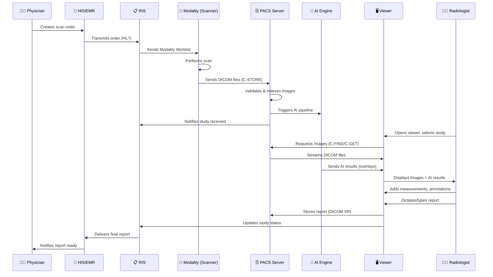

---

## 7. Technologies Used

| Technology | Purpose | Simple Explanation |
|------------|---------|-------------------|
| **DICOM** | Universal medical image format | The standard "language" all medical imaging equipment uses to create and share images. |
| **PACS** | Central image storage and retrieval | The hospital's digital filing system for medical images. |
| **HL7 / FHIR** | Hospital system communication | The messaging standard that allows the HIS, RIS, PACS, and other systems to talk to each other. |
| **GPU Rendering** | Fast image display | The graphics card in the workstation displays complex medical images instantly. |
| **WebGL / VTK** | 3D visualization | Software libraries that draw 3D medical models in a web browser or desktop application. |
| **Deep Learning CNN** | AI image analysis | A type of AI that learns from millions of images to identify patterns and abnormalities. |
| **DICOM SR** | Structured report storage | A machine-readable version of the radiologist's report, stored alongside the images. |
| **Voice Recognition / NLP** | Report dictation | Converts the radiologist's spoken words into text automatically. |
| **REST API / WebSocket** | Real-time data communication | Allows the viewer, AI engine, and PACS to communicate in real time. |

---

## 8. Benefits

| Beneficiary | Benefit |
|-------------|---------|
| **Radiologist** | Faster access to images, AI assistance reduces reading time, auto-report drafting. |
| **Referring Physician** | Faster report turnaround, digital access from any location. |
| **Hospital** | Reduced paper, faster workflows, better use of radiologist time, regulatory compliance. |
| **Patient** | Faster diagnosis, fewer repeat scans, safer treatment planning. |
| **Administrators** | Full audit trail, digital archiving, no lost films. |

---

## 9. Summary

This question describes the **complete journey of a medical image**, from the moment a patient is scanned to the moment the doctor's report is ready. The workflow involves multiple tightly integrated systems — the scanner, PACS storage, the AI engine, and the reporting viewer — all communicating seamlessly. Our innovation lies in the integration of real-time AI assistance, predictive image prefetching, and automated report generation, all within a fully DICOM-compliant architecture, delivering faster, more accurate, and more reliable radiology services.

---

---

<a name="question-2"></a>
# Question 2
## 3D Annotation on Smaller Screens & 2D-to-3D Image Conversion

---

## 1. Overview

### What Is This?

When a doctor looks at a medical scan, they usually see it as a flat, 2D image — like looking at a slice of bread from the side. But the human body is three-dimensional, and sometimes a 2D view is not enough.

Our system takes hundreds of these flat 2D slice images and **rebuilds them into a full 3D model** — like reassembling a loaf of bread into its original shape. This 3D model can be rotated, zoomed into, cut open, and annotated (marked with notes), all in real time.

This question explains both:
1. **How 2D medical images become a 3D model.**
2. **How doctors annotate that 3D model — even on a small screen, like a laptop or tablet.**

### Why Is It Needed?

Some medical conditions are almost impossible to fully understand from 2D images alone:
- **Tumour planning** — surgeons need to see exactly how a tumour relates to surrounding blood vessels in 3D before operating.
- **Orthopaedics** — complex bone fractures are far easier to understand in 3D.
- **Cardiac imaging** — the heart's chambers and valves need to be seen from all angles.

For smaller screens (like tablets used in ward rounds, or laptops in remote reading), the 3D tools must be **responsive, efficient, and touch-friendly**.

### Where Is It Used?

- Radiology viewing workstations.
- Mobile/tablet devices for on-call radiologists.
- Surgical planning software integrated with our PACS.
- Teleradiology (remote reading from any location).

---

## 2. What Is Happening?

### Simple Explanation

Think of the body's internal structures like a three-dimensional sculpture. A CT scan takes hundreds of very thin "photographic slices" through that sculpture. Our system's job is to:

1. Take all those slices.
2. Stack them up precisely, one on top of the other.
3. Fill in the space between slices intelligently.
4. Render the result as a 3D image the doctor can interact with.

Once in 3D, the doctor can:
- **Rotate** the model by touching/clicking and dragging.
- **Zoom in** with pinch gesture (on touch) or scroll wheel.
- **Cut through** the model to look inside.
- **Place annotation pins and labels** that stay attached to the 3D model as it moves.

On a **smaller screen**, the system intelligently adjusts:
- Tool panel sizes and layouts.
- Rendering quality (to save processing power on weaker devices).
- Touch targets made larger for finger-based interaction.

---

## 3. How Is It Happening?

### Part A — Converting 2D DICOM Slices into a 3D Volume

#### Step 1 — Load All DICOM Slices

The viewer loads all DICOM files for a series (e.g., all 500 slices of a chest CT). Each DICOM file contains:
- A 2D image (grid of pixels).
- Position information (where exactly this slice was in the body, in X/Y/Z coordinates).
- Slice thickness (how thin each slice is — e.g., 1mm, 0.5mm).

#### Step 2 — Build the 3D Volume (Voxel Grid)

The software arranges all slices in their correct 3D positions, creating a **voxel grid**.

> 💡 **What is a Voxel?**
> A **pixel** is a tiny square dot in a 2D image. A **voxel** is the 3D equivalent — a tiny cube of space. If you imagine a 3D grid of tiny cubes, each cube holds one brightness value (how dense the tissue is at that point in space). Together, they form a complete 3D data structure called a **volume**.

This volume is loaded into the computer's memory (RAM + GPU memory).

#### Step 3 — Volume Rendering

Simply having a voxel grid is not enough — we need to turn it into something a human can see and understand. This is done through **volume rendering**.

There are three main rendering techniques:

| Technique | What It Does | When Used |
|-----------|-------------|----------|
| **MIP (Maximum Intensity Projection)** | Shows the brightest voxels along each viewing ray. Good for blood vessels and dense structures. | Angiography, bone. |
| **VRT (Volume Rendering Technique)** | Assigns different colours and transparencies to different tissue types. Shows a full 3D coloured view. | Surgical planning, oncology. |
| **MPR (Multiplanar Reformation)** | Recuts the volume along any flat plane — creates a new 2D slice at any angle the doctor chooses. | Routine review, fine measurement. |

Our system uses the computer's **GPU (Graphics Processing Unit)** to perform this rendering in real time. The GPU can process millions of voxels per frame, giving the doctor a smooth, interactive 3D experience.

#### Step 4 — Applying Transfer Functions

A **transfer function** is a set of rules that tells the rendering engine how to colour and how transparent to make each tissue type based on its density value.

For example:
- Air (density ~-1000 HU) → Black, fully transparent.
- Fat (density ~-100 HU) → Yellow-orange, slightly transparent.
- Soft tissue (density ~40 HU) → Pink-red, semi-transparent.
- Bone (density ~400+ HU) → White, fully opaque.

By adjusting these rules, the radiologist can make soft tissue disappear and only show bones, or vice versa. Our system offers pre-configured transfer function presets (e.g., "Chest CT", "Bone", "Abdominal", "Cardiac"), plus manual adjustment.

#### Step 5 — AI-Assisted Segmentation Integration

Before or during 3D rendering, the AI segmentation engine (see Question 3) may have already identified the boundaries of specific organs or lesions. These boundaries are overlaid on the 3D model as **coloured meshes** (3D outlines), making it easy to distinguish, say, the liver from the kidneys in a single colour-coded view.

---

### Part B — Annotation in 3D

#### What Does "Annotation in 3D" Mean?

In 2D, a doctor can draw a circle or write text on a flat image. In 3D, the annotation must exist in **three-dimensional space** — it must be attached to a specific point or region on the 3D model, and it must stay there correctly no matter how the model is rotated or zoomed.

This is a fundamentally harder problem than 2D annotation.

#### Step 1 — 3D Point Picking

When the doctor clicks on a point in the 3D view, the system must figure out which physical point in 3D space (X, Y, Z coordinates in the patient's coordinate system) was clicked. This is called **ray casting** — an invisible ray is shot from the camera through the clicked pixel, and the system finds where that ray first intersects the 3D model.

The result is a precise 3D world coordinate.

#### Step 2 — Anchor Point Creation

Once the 3D coordinate is identified, the system creates an **anchor point** — a persistent 3D marker stored in the coordinate system of the volume. This marker is expressed in real-world units (millimetres), not screen pixels.

Because the anchor is stored in 3D space (not screen space), it will always appear in the correct position on the 3D model, no matter how the model is rotated, zoomed, or panned.

#### Step 3 — Annotation Data Structure

Each annotation is stored as a data object containing:
- **3D world coordinates** (X, Y, Z in mm)
- **Type** (point, line, sphere, box, freeform)
- **Label text** (the doctor's note)
- **Author** (radiologist's ID)
- **Timestamp**
- **Linked DICOM reference** (which study and series this belongs to)

This data is stored as a **DICOM RT Structure Set** or **DICOM SEG** file, which is the international standard for storing 3D annotation data.

#### Step 4 — Real-Time Synchronization (3D ↔ 2D)

Our system maintains a **synchronized view**. When the radiologist places an annotation in the 3D view:
- The corresponding location is automatically shown in all three 2D planes (axial, sagittal, coronal — which are the three flat cutting directions through the body).
- Any changes in 2D are reflected in 3D in real time.
- This two-way synchronization ensures the radiologist never loses track of what they are looking at.

---

### Part C — Optimisation for Smaller Screens

#### The Challenge

A full-featured 3D medical imaging workstation typically has:
- A high-end GPU with 8-16GB of video memory.
- One or two large, high-resolution monitors (e.g., 4K, 30-inch).
- Fast internal network.

A tablet, laptop, or mobile device has:
- A much weaker integrated GPU.
- A smaller screen (10-15 inches).
- Possibly a slower network connection.
- Touch input instead of mouse + keyboard.

Our system handles this through **adaptive rendering and responsive UI design**.

#### Responsive Techniques Used

| Problem | Solution |
|---------|---------|
| **GPU is too weak for full-resolution 3D** | Dynamically reduce rendering resolution during interaction; use full quality only when the image is still (at rest). |
| **Screen too small for full tool panels** | Collapse tool panels into a slide-out drawer; show only commonly used tools by default. |
| **Touch targets are too small** | All buttons and handles are enlarged for touch; support pinch-to-zoom, swipe, and drag gestures. |
| **Network is slow** | Use progressive loading — show a low-resolution preview first, then upgrade to full resolution. |
| **Limited memory** | Load only a subvolume (the region of interest) rather than the entire 3D volume. |

#### Adaptive Level of Detail (LOD)

Our 3D engine dynamically adjusts the number of voxels being rendered based on the current device's performance. When the user is actively rotating the model, the rendering switches to a lower-resolution "interaction mode" for smoothness. As soon as the user stops moving, the rendering upgrades to full quality — this happens seamlessly, usually in less than one second.

---

## 4. AI Involvement

AI plays two important roles in 3D visualization:

### Role 1 — AI-Assisted Super-Resolution (Gap Filling)

In practice, CT and MRI scans do not have perfectly equal spacing between all slices. Sometimes slices are 1mm apart, sometimes 5mm apart. When they are far apart, reconstructing a 3D model leaves noticeable visual gaps.

Our system uses an **AI-based interpolation model** (a neural network trained on medical volumes) to intelligently estimate the appearance of the space between slices. This produces a much smoother and more accurate 3D model compared to traditional linear interpolation.

### Role 2 — Automatic Annotation Suggestion

After performing segmentation (see Question 3), the AI can automatically place suggested annotation labels on the 3D model — for example, labelling the left kidney, right kidney, liver, aorta, and spinal cord in a single CT scan. The radiologist can accept, reject, or modify these AI-suggested labels.

---

## 5. Complete Workflow

1. Radiologist selects a study with a volumetric series (e.g., CT chest).
2. Viewer loads all DICOM slices into memory.
3. System reads slice position and thickness from DICOM headers.
4. Voxel grid (3D volume) is constructed in GPU memory.
5. AI interpolation fills gaps between slices (where applicable).
6. AI segmentation results are loaded as coloured 3D meshes.
7. Transfer function presets are applied based on study type.
8. 3D model is rendered on screen using GPU-accelerated volume rendering.
9. Radiologist interacts: rotates, zooms, and pans using mouse or touch.
10. Radiologist clicks a location to place an annotation (ray casting finds 3D coordinates).
11. An anchor point is stored in 3D world coordinates.
12. AI suggests additional annotation labels (radiologist reviews).
13. All annotations are saved as DICOM RT Structure / SEG files.
14. 2D views auto-update to show corresponding slice locations.
15. On smaller screens, adaptive rendering and responsive UI ensure smooth experience.

---

## 6. Flow Diagrams

### 2D to 3D Conversion Flowchart

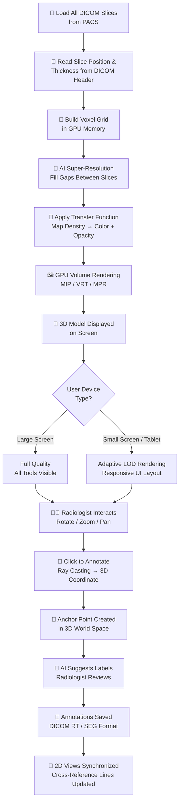

### 3D Annotation Sequence Diagram

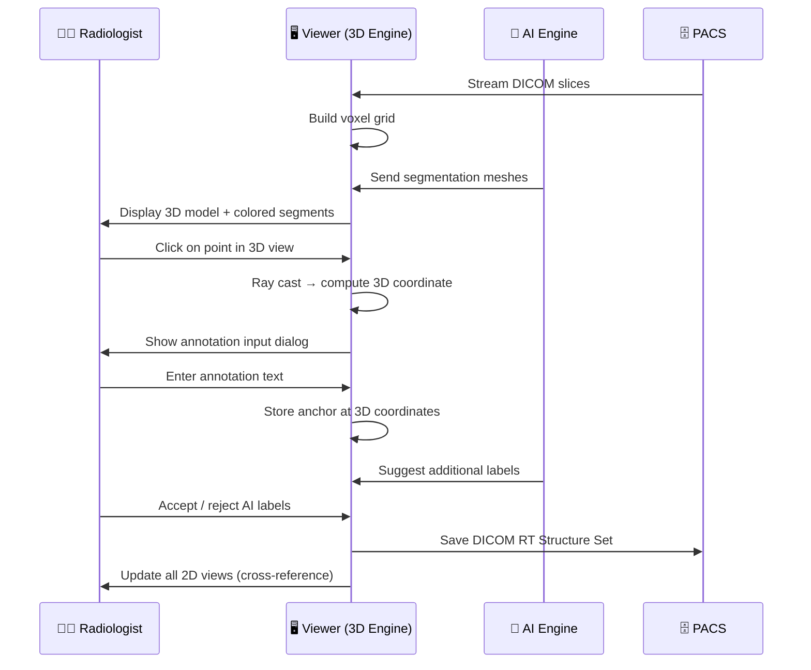

---

## 7. Technologies Used

| Technology | Simple Explanation |
|------------|-------------------|
| **WebGL / OpenGL** | Low-level graphics APIs that allow the computer's GPU to draw 3D graphics very fast. |
| **VTK (Visualization Toolkit)** | A widely used medical imaging library that provides volume rendering, mesh processing, and 3D tools. |
| **DICOM RT Structure Set / SEG** | Standard DICOM formats for storing 3D annotations and segmentation data. |
| **Ray Casting Algorithm** | Mathematical method to find what 3D point was clicked in a 2D projection. |
| **Transfer Functions** | Maps density values to colours and transparencies for 3D rendering. |
| **Adaptive LOD (Level of Detail)** | Reduces rendering complexity on slower devices, automatically. |
| **AI Super-Resolution / Interpolation CNN** | Neural network that intelligently estimates missing data between image slices. |
| **Responsive CSS / Touch Events** | Web technologies that adapt the interface layout for any screen size. |

---

## 8. Benefits

| Beneficiary | Benefit |
|-------------|---------|
| **Radiologist** | Can understand complex anatomy in 3D; annotations persist correctly during 3D exploration. |
| **Surgeon** | Can use 3D annotated models for pre-operative planning without needing separate software. |
| **Patient** | Faster, more accurate surgical plans; better understanding of their own condition with visual models. |
| **Hospital** | One unified platform handles 2D and 3D review; no need for separate 3D workstation software. |
| **Remote Readers** | Full 3D capability accessible on a laptop or tablet from any location. |

---

## 9. Summary

This question explained two closely related things: how flat 2D medical image slices are assembled into an interactive 3D model, and how doctors annotate that 3D model — even on a smaller screen like a tablet or laptop. The key innovations are: AI-assisted slice interpolation for smoother 3D models, persistent 3D anchor-based annotations that stay fixed during rotation, real-time 2D-3D synchronization, and adaptive rendering that intelligently scales down for weaker devices without sacrificing diagnostic quality.

---

---

<a name="question-3"></a>
# Question 3
## Segmentation: Methods, AI Innovation, and Comparison with Prior Art

---

## 1. Overview

### What Does "Segmentation" Mean?

In everyday life, the word "segmentation" means dividing something into parts. In medical imaging, **segmentation** means identifying and outlining a specific structure in a medical image.

For example:
- Drawing a precise outline around a tumour in a CT scan.
- Identifying and colouring each organ in an MRI scan (liver, kidneys, spleen, etc.).
- Tracing the exact boundary of a blood vessel.

The result of segmentation is a **mask** — a layer placed over the image that precisely marks where a particular structure is located.

### Why Is Segmentation Required?

Segmentation serves many critical purposes:

| Purpose | Why It Matters |
|---------|---------------|
| **Tumour Measurement** | Precise size and volume of a tumour helps oncologists track whether a cancer is growing or shrinking in response to treatment. |
| **Radiation Therapy Planning** | Radiation oncologists need to know exactly where a tumour ends and normal tissue begins — radiation must be precisely targeted. |
| **Surgical Planning** | Surgeons need to know the exact location and boundaries of structures they will encounter during an operation. |
| **Organ Volume Calculation** | Measuring the size of the liver or kidney can indicate disease. |
| **AI Training Data** | Segmented images are used to train future AI models. |

Without segmentation, radiologists would have to estimate sizes and boundaries visually — a process that is subjective, time-consuming, and inconsistent between different doctors.

### Where Is It Used in Our System?

Segmentation is used in:
- The viewer (where results are displayed as coloured overlays).
- The AI engine (where the actual segmentation computation occurs).
- The 3D visualization (where segmented structures become 3D coloured meshes).
- Reporting (where segmented measurements populate the report automatically).

---

## 2. What Is Happening?

### Simple Explanation

Imagine a black-and-white photograph of a crowded street. Segmentation is like asking the computer to draw an outline around every car, every person, every building — separately, precisely, and automatically.

In medical imaging, the "photograph" is the CT or MRI scan, and the "objects" are organs and lesions. The computer must:
1. Look at the image.
2. Understand what each region of the image represents (liver? tumour? background?).
3. Draw precise pixel-level outlines around each structure.
4. Label each outlined structure with a name (e.g., "Liver", "Right Kidney", "Lesion #1").
5. Save those outlines so they can be displayed on the image.

---

## 3. How Is It Happening?

### Step-by-Step Segmentation Workflow

#### Step 1 — Image Loading & Pre-Processing

The DICOM images are loaded from PACS. Before being sent to the AI model, they undergo pre-processing:

- **Normalization** — pixel intensity values are rescaled to a standard range (e.g., 0 to 1) so the AI model sees consistent data regardless of the scanner brand or settings.
- **Resampling** — the voxel spacing is standardized (e.g., all images resampled to 1mm × 1mm × 1mm voxels) so the AI model does not have to handle variable slice thicknesses.
- **Cropping/Padding** — the volume is cropped or padded to a fixed input size that matches what the AI model expects.
- **Windowing** — specific DICOM window/level settings are applied to emphasize the tissue type of interest.

#### Step 2 — Model Inference (The AI Does the Segmentation)

The pre-processed volume is fed into the segmentation AI model. The AI examines every voxel in the volume and outputs a **probability map** — for each voxel, it assigns a probability score between 0 and 1 for each possible class (e.g., probability of being liver, probability of being tumour, probability of being background).

#### Step 3 — Post-Processing

The raw probability map is cleaned up:

- **Thresholding** — any voxel with a probability above a threshold (e.g., 0.5) is classified as belonging to a structure; below the threshold is classified as background.
- **Connected Component Analysis** — isolated "islands" of incorrectly labelled voxels are removed.
- **Morphological Operations** — small holes inside segmented regions are filled; rough jagged edges are smoothed.
- **Largest Component Selection** — for structures that should be a single contiguous region (like the liver), only the largest connected component is kept.

#### Step 4 — Output Generation

The final segmentation mask is output as:
- A **DICOM SEG file** — a standardized file that stores the segmentation mask alongside the original images.
- A **DICOM RT Structure Set** — for radiation therapy planning.
- A **3D mesh** (polygon surface) — for 3D visualization in the viewer.

#### Step 5 — Display and Review

The segmentation overlays appear on the viewer as:
- Coloured transparent masks on 2D slices.
- Coloured 3D surfaces in the 3D view.
- Automatically calculated volume measurements (e.g., "Liver Volume: 1,450 cm³").

The radiologist reviews the segmentation. If anything is incorrect:
- They can manually edit the mask (add or remove regions using a paint brush tool).
- Correct the AI's work slice by slice.

All edits are tracked and the corrected segmentation is saved.

---

## 4. Traditional Segmentation Methods (Prior Art)

Before AI-based segmentation, radiologists and researchers used the following methods:

### Method 1 — Manual Segmentation

A radiologist or trained technician manually drew around every structure, slice by slice.

- **How:** Using a mouse or stylus, the user traces the boundary of the structure on every 2D slice.
- **Problem:** For a liver in a 500-slice CT, this means tracing the boundary on every slice where the liver appears — typically 100-200 slices. This can take **30 to 90 minutes** per organ, per scan.
- **Limitations:** Very slow, highly labour-intensive, subjective (two radiologists may draw slightly different boundaries), not scalable.

### Method 2 — Thresholding

The simplest automatic method. The system selects all pixels within a specific density range.

- **How:** The user sets a density range (e.g., 40 HU to 100 HU for soft tissue). All pixels in that range are coloured as the target structure.
- **Problem:** Different structures often overlap in density. The spleen, liver, and muscle all have similar HU values. This method cannot distinguish them.
- **Limitations:** Only works well for very high-contrast structures (e.g., bone at >400 HU). Cannot handle complex anatomy.

### Method 3 — Region Growing

The user clicks inside the target structure (a "seed point"), and the algorithm expands outward, including neighbouring pixels that are similar in intensity.

- **How:** Starting from the seed point, the algorithm keeps "growing" into adjacent pixels until it reaches a boundary where intensity changes significantly.
- **Problem:** Leaks through thin boundaries, gets confused by noise, fails when the target structure connects to another structure of similar intensity.
- **Limitations:** Still requires significant user interaction, frequently produces incorrect results for complex shapes.

### Method 4 — Active Contours ("Snakes") and Level Sets

More sophisticated mathematical methods where a curve (in 2D) or surface (in 3D) evolves from an initial user-drawn shape until it settles on the structure boundary.

- **How:** A mathematical energy function is minimized — the curve is attracted toward intensity gradients (edges) and regularized to stay smooth.
- **Problem:** Requires careful initialization (the user must draw a rough initial shape). Sensitive to noise and weak edges. Can get trapped in local minima (wrong boundaries).
- **Limitations:** Still requires significant user setup; slow for large volumes; does not generalize well across different patients and scanners.

### Method 5 — Atlas-Based Segmentation

A reference "atlas" image (from a carefully segmented reference patient) is deformed to match a new patient's anatomy.

- **How:** Mathematical image registration (deformable warping) is used to warp the atlas to match the new image. The segmentation labels from the atlas are transferred to the new image.
- **Problem:** Works only when patient anatomy is close to the atlas. Fails for patients with unusual anatomy, large tumours, surgical changes, or diseases that distort normal anatomy.
- **Limitations:** Computationally slow, poor performance on pathological cases.

---

## 5. AI-Based Segmentation — Our Approach

### What AI Model Is Used?

Our system uses a **3D U-Net** architecture — a deep learning neural network specifically designed for medical image segmentation.

> 💡 **What is a Neural Network?**
> A neural network is a computer system loosely modelled after the human brain. It learns from examples. When shown thousands of CT scans where a radiologist has already drawn the liver outline, the neural network learns what the liver looks like and can then find the liver in new scans it has never seen before.

> 💡 **What is a U-Net?**
> A U-Net is a specific type of neural network designed for segmentation. It has a distinctive "U" shape: it first compresses the image into a small, high-level representation (extracting features), then expands it back to full size while adding detail (generating the segmentation mask). The special feature is "skip connections" — shortcuts that carry fine-grained detail from the compression stage directly to the expansion stage, preserving precise boundary information.

### Why 3D U-Net Specifically?

Most early medical image AI models operated on single 2D slices. A 3D U-Net operates on the full 3D volume simultaneously:

- It can see context from **above and below** each slice — not just the current slice in isolation.
- This allows it to understand that a structure continues from one slice to the next, producing smoother and more accurate 3D boundaries.
- It is far more accurate for structures with complex 3D shapes (like the liver, with its curved surfaces and irregular margins).

### Enhanced Architecture (Our Innovation)

Our system extends the standard 3D U-Net with additional innovations:

1. **Attention Gates** — the model learns to focus on the most relevant regions of the image and ignore background distractors.
2. **Multi-Scale Feature Fusion** — features extracted at different levels of detail are combined at inference time, capturing both fine local details and broad contextual understanding simultaneously.
3. **Uncertainty Estimation** — our model outputs not just a segmentation mask, but also a pixel-wise uncertainty map — showing the radiologist where the AI is less confident, so they know exactly where to focus their manual review.

### What Goes Into the AI Model?

| Input | Description |
|-------|-------------|
| **Pre-processed 3D volume** | Normalized, resampled DICOM image volume. |
| **Study type context** | Indication of whether this is a CT, MRI, PET, etc. (used to select the correct model). |
| **Prior segmentation (optional)** | If a prior scan exists, it can be used to guide the new segmentation. |

### What Comes Out of the AI Model?

| Output | Description |
|--------|-------------|
| **Segmentation mask** | A 3D volume where each voxel is labelled with a class (liver, kidney, tumour, background, etc.). |
| **Confidence/probability map** | Per-voxel probability scores for each class. |
| **Uncertainty map** | Highlights where the model is less certain. |
| **Volume measurements** | Automatic calculation of structure volumes from the mask. |
| **Bounding box** | Coordinates defining the smallest 3D box containing the structure. |

---

## 6. Comparison with Prior Art

### Comparison Table

| Feature | Manual Segmentation | Thresholding / Region Growing | Atlas-Based | Our AI (3D U-Net + Attention) |
|---------|--------------------|-----------------------------|-------------|-------------------------------|
| **Speed** | 30-90 min per organ | Seconds (but inaccurate) | Minutes (but limited) | **10-30 seconds per organ** |
| **Accuracy** | High (if expert) | Low | Moderate | **High to Very High** |
| **User Interaction Required** | Extensive | Moderate | Moderate | **Minimal (review only)** |
| **Works for Pathological Anatomy?** | Yes (if experienced) | No | No | **Yes** |
| **Generalization (different scanners)** | Yes | Limited | Limited | **Yes (if well-trained)** |
| **3D Continuity** | Slice-by-slice (inconsistent) | No awareness | Atlas-dependent | **Full 3D awareness** |
| **Uncertainty Information** | None | None | None | **Yes (uncertainty map)** |
| **Multi-Organ Simultaneous** | No (one at a time) | No | Possible but slow | **Yes (all organs in one pass)** |
| **Scalability** | Very poor | Good | Moderate | **Excellent** |

### Key Differentiators of Our Approach

1. **Full 3D context** — unlike 2D methods that work slice by slice, our model sees the entire 3D volume at once.
2. **Uncertainty quantification** — no prior art commercial systems provide per-voxel uncertainty maps that guide radiologist review. This is our key innovation.
3. **Multi-organ + lesion simultaneous segmentation** — in a single inference pass, our model can segment multiple organs AND any detected lesions, with different colours for each.
4. **Adaptive model selection** — based on the study type, body part, and clinical indication, our system automatically selects the most appropriate trained model from a library of specialized models.

---

## 7. AI Involvement

### AI Model Used
- **Primary:** 3D U-Net with Attention Gates and Uncertainty Head.
- **Supplementary:** Vision Transformer (ViT) layers integrated into the encoder for global context understanding on large field-of-view images.

### Training Data
- Trained on large, curated datasets including **Medical Segmentation Decathlon**, **TCIA (The Cancer Imaging Archive)**, and proprietary hospital data.
- Validated on held-out test sets from independent institutions.

### Inference Time
- Typical CT multi-organ segmentation: **10-30 seconds**.
- This runs in the background without interrupting the radiologist's 2D review.

---

## 8. Complete Workflow

1. DICOM series received from PACS.
2. Study type detected (CT / MRI / PET etc.).
3. Appropriate AI segmentation model selected from library.
4. Pre-processing: normalize, resample, window.
5. 3D volume fed into 3D U-Net.
6. AI model runs inference; outputs probability maps + uncertainty map.
7. Post-processing: thresholding, connected component analysis, smoothing.
8. Segmentation masks saved as DICOM SEG files.
9. 3D meshes generated for 3D visualization.
10. Results displayed as coloured overlays in viewer.
11. Volume measurements auto-calculated and displayed.
12. Uncertainty regions highlighted for radiologist review.
13. Radiologist reviews, edits if necessary.
14. Final segmentation saved; measurements populate report.

---

## 9. Flow Diagrams

### Segmentation Workflow Flowchart

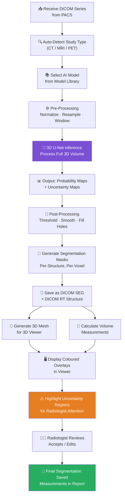

### Traditional vs. AI Segmentation Comparison Diagram

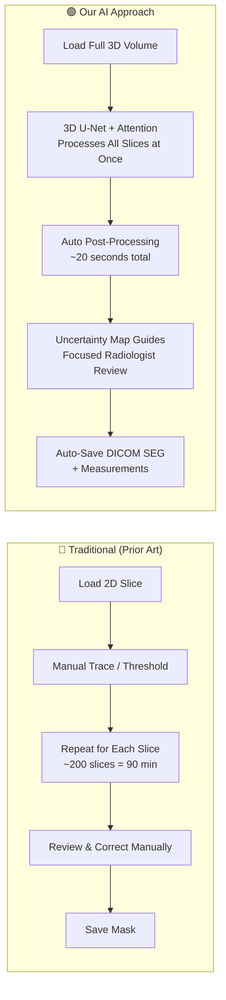

---

## 10. Technologies Used

| Technology | Simple Explanation |
|------------|-------------------|
| **3D U-Net** | A deep learning model shaped like a "U" that learns to segment structures in 3D medical images. |
| **Attention Gates** | A mechanism that helps the AI focus on relevant regions and ignore noise. |
| **Dropout-Based Uncertainty** | A technique (Monte Carlo Dropout) that runs the model multiple times with slight variations to estimate how confident it is. |
| **DICOM SEG** | DICOM standard format for storing segmentation masks. |
| **DICOM RT Structure Set** | DICOM format used specifically in radiation therapy for storing organ and target contours. |
| **VTK Marching Cubes** | An algorithm that converts a 3D segmentation mask into a smooth 3D surface mesh for visualization. |
| **PyTorch / ONNX** | AI training framework (PyTorch) and model exchange format (ONNX) for deploying models across platforms. |
| **Medical Segmentation Decathlon Dataset** | A public benchmark dataset of medical images with expert annotations, used to train our models. |

---

## 11. Benefits

| Beneficiary | Benefit |
|-------------|---------|
| **Radiologist** | 90-minute manual task reduced to 30-second AI task with focused human review. |
| **Oncologist** | Precise tumour volumes tracked over time; removes subjectivity from measurements. |
| **Radiation Therapist** | Automatically generated organ contours for radiation planning, reducing planning time from days to hours. |
| **Surgeon** | Accurate 3D organ boundaries visible before making a single incision. |
| **Patient** | Faster diagnosis and treatment planning; more consistent and reproducible measurements. |
| **Hospital** | Fewer human errors; better workflow throughput; reduced radiologist burnout. |

---

## 12. Summary

Segmentation is the process of precisely outlining specific structures (organs, tumours, blood vessels) in medical images. Traditional methods — manual tracing, thresholding, region growing, and atlas-based approaches — are slow, inaccurate for complex anatomy, and unable to work across different patients reliably. Our AI system uses a 3D U-Net enhanced with attention gates and uncertainty estimation, which processes the entire 3D scan in seconds, simultaneously segments multiple structures, and uniquely provides an uncertainty map so radiologists know exactly where to focus their review. This represents a significant improvement over all known prior art.

---

---

<a name="question-4"></a>
# Question 4
## The Complete Role of AI in the System

---

## 1. Overview

### What Is AI in This Context?

In everyday life, AI (Artificial Intelligence) is used in things like voice assistants, photo recognition on smartphones, and recommendation engines on streaming services.

In medical imaging, **AI is a computer system that has been trained — by learning from thousands or millions of medical images and expert-labelled examples — to perform specific tasks that would normally require a trained radiologist.** It does not replace the radiologist; it assists them by doing the repetitive, pattern-recognition parts of the work faster and more consistently.

### Why Is AI Used?

| Problem Without AI | How AI Solves It |
|--------------------|-----------------|
| Radiologists are overwhelmed with large volumes of scans. | AI processes images in seconds and prioritizes the most urgent cases. |
| Visual fatigue leads to missed findings ("oversight error"). | AI never gets tired and consistently scans every pixel. |
| Measurements are subjective and inconsistent. | AI provides objective, reproducible measurements every time. |
| Report writing is slow. | AI generates a draft report in seconds for the radiologist to review. |
| Complex 3D anatomy is hard to visualize. | AI segments organs/lesions and presents them as colour-coded 3D models. |
| Critical findings may be reported slowly. | AI detects critical findings and alerts the radiologist immediately. |

### Where Is AI Used in Our System?

AI is not a single feature — it is woven throughout the entire imaging pipeline:

1. Image quality checking (on arrival at PACS).
2. Automatic prioritization of the worklist.
3. Detection of abnormalities.
4. Segmentation of organs and lesions.
5. Automatic measurement.
6. 3D model enhancement.
7. Report generation assistance.

---

## 2. What Problems Does AI Solve?

### Problem 1 — Radiologist Shortage and Workload

Globally, there is a severe shortage of radiologists, particularly in developing countries and rural hospitals. At the same time, the number of medical scans being taken is increasing every year. AI bridges this gap by handling much of the repetitive pattern-matching work.

### Problem 2 — Diagnostic Consistency

When the same scan is reviewed by two different radiologists, they often produce slightly different results — different measurements, different confidence levels. This is called **inter-observer variability**. AI always produces the same result for the same input, providing a consistent baseline.

### Problem 3 — Time-Critical Diagnoses

Conditions like brain haemorrhage (bleeding in the brain), pulmonary embolism (blood clot in the lungs), and acute stroke require immediate diagnosis. AI can detect these within seconds of the scan completing and trigger an urgent alert — even before a radiologist is available to review the images.

### Problem 4 — Missed Findings

Studies have shown that radiologists can miss small nodules, subtle fractures, or early-stage lesions, especially when reviewing large numbers of scans under time pressure. AI acts as a safety net, flagging any finding it detects so the radiologist can give it a second look.

### Problem 5 — Slow Report Turnaround

Traditional report generation requires the radiologist to type or dictate everything from scratch. AI-assisted reporting provides a pre-generated draft report based on detected findings, which the radiologist edits and finalizes — cutting report time significantly.

---

## 3. What Functions Does AI Perform?

### Function 1 — Image Quality Assessment (IQA)

**What it does:** Immediately after images arrive at PACS, an AI model evaluates the image quality.

It checks for:
- Motion artefacts (blurring from patient movement during the scan).
- Noise levels (are the images too grainy to be diagnostic?).
- Incorrect patient positioning.
- Incomplete coverage (was the correct body region scanned?).

If quality is insufficient, the system can automatically flag the study for a rescan **before** the radiologist begins reviewing it — saving everyone's time.

**AI Model:** Convolutional Neural Network (CNN) classifier trained on thousands of good and bad quality scans.

---

### Function 2 — Worklist Prioritization

**What it does:** Not all scans are equally urgent. A brain CT for a stroke patient must be read before a routine chest X-ray.

Our AI continuously analyses all pending studies and re-orders the radiologist's worklist based on:
- **Clinical urgency** (based on the ordering physician's indication text, analysed by NLP — Natural Language Processing, an AI technique for understanding text).
- **Detected findings** (AI quickly scans new images for signs of critical conditions).
- **Time waiting** (studies are not ignored indefinitely).
- **Patient demographics** (age, history, prior critical findings).

**AI Model:** A combination of NLP model (for clinical context analysis) and a classification CNN (for image-based urgency detection).

---

### Function 3 — Detection and Localisation

**What it does:** AI scans the images and identifies regions that may represent abnormalities.

Examples:
- **Pulmonary nodule detection** — finds small round spots in the lung that could be early-stage cancer.
- **Intracranial haemorrhage detection** — finds bleeding in the brain from a head CT.
- **Fracture detection** — identifies broken bones from X-rays and CTs.
- **Lesion detection in the liver, pancreas, prostate** — from CT and MRI.

The AI marks detected findings with bounding boxes and overlay highlights on the viewer. Each detection comes with a **confidence score** (e.g., 92% probability of pulmonary nodule at location X).

**AI Model:** 3D Convolutional Neural Network (CNN) based object detection architecture (e.g., modified RetinaNet or YOLO adapted for 3D medical volumes).

---

### Function 4 — Segmentation

Already described in full in Question 3. In summary:
- AI precisely delineates the boundaries of organs and lesions at the individual voxel level.
- Uses 3D U-Net with attention gates.
- Outputs segmentation masks + volume measurements + uncertainty maps.

---

### Function 5 — Automated Measurement

**What it does:** Once a structure has been detected and segmented, AI automatically calculates:
- **Linear measurements** (e.g., longest diameter of a tumour in mm).
- **Volume** (e.g., total tumour volume in cm³, liver volume).
- **Density statistics** (mean, min, max Hounsfield Units within a structure).
- **Bi-directional measurements** (longest diameter + perpendicular diameter, used in oncology response criteria like RECIST).
- **Longitudinal comparison** — AI compares measurements from prior scans to track progression over time.

These measurements are presented in the viewer and pre-filled into the report template.

---

### Function 6 — AI-Assisted Report Generation (NLP)

**What it does:** The AI combines all its findings (detections, segmentations, measurements) with the patient's clinical context and generates a structured draft report.

This draft includes:
- A clinical indication section (from the referral text).
- A technique section (type of scan, contrast used, etc.).
- A findings section (listing all detected and measured findings).
- An impression section (a summary conclusion).

The radiologist then:
1. Reads the draft.
2. Edits any inaccuracies.
3. Adds any findings the AI may have missed (radiologist always has final authority).
4. Signs and finalizes the report.

**AI Model:** Large Language Model (LLM) fine-tuned on radiology reports, combined with a structured data formatter that converts AI detections into natural language.

---

### Function 7 — Critical Finding Alert

**What it does:** If the AI detects a life-threatening condition with high confidence, it immediately sends an alert:
- On the radiologist's screen.
- As a notification to the ordering physician.
- Via integrated messaging systems.

This ensures time-critical conditions (e.g., brain bleed, aortic dissection, massive pulmonary embolism) receive immediate attention — without waiting for a radiologist to begin their normal queue review.

---

## 4. AI Input → Processing → Output Flow

### Input Data

| Input | Description |
|-------|-------------|
| **DICOM Images** | The raw medical scan images. |
| **DICOM Header Data** | Patient metadata, scan parameters, body region. |
| **Prior Scans (if available)** | For longitudinal comparison. |
| **Clinical Text** | Referral reason, patient history (from HIS/RIS). |
| **Study Type / Protocol** | CT, MRI, X-ray — determines which AI model to use. |

### Pre-Processing

| Step | What Happens |
|------|-------------|
| **Format Decoding** | DICOM pixel data decoded and converted to numeric array. |
| **Normalization** | Intensity values scaled to standard range. |
| **Resampling** | Volume resampled to isotropic spacing (equal X/Y/Z resolution). |
| **Orientation Correction** | Volume re-oriented to standard anatomical orientation. |
| **Windowing** | Relevant density window applied for the target tissue. |
| **Artefact Reduction** | Metal artefact reduction for patients with implants. |

### AI Inference

Each AI function runs its appropriate model:
- Image quality → **Classification CNN**
- Detection → **3D Object Detection CNN**
- Segmentation → **3D U-Net with Attention**
- Report text → **Radiology-tuned LLM**
- Prioritization → **Multi-modal classifier (image + text)**

Models are hosted on a GPU inference server with:
- **Model caching** — frequently used models kept in memory.
- **Batch processing** — multiple studies processed simultaneously.
- **Asynchronous execution** — AI processing runs in parallel with radiologist review, not after it.

### Post-Processing

| Step | What Happens |
|------|-------------|
| **Probability Thresholding** | Convert probability maps to binary predictions. |
| **NMS (Non-Maximum Suppression)** | Remove duplicate detections of the same finding. |
| **Connected Component Analysis** | Clean up segmentation masks. |
| **Clinical Range Filtering** | Suppress detections that are clinically implausible (e.g., a 10cm nodule when the maximum expected size is 3cm). |
| **Coordinate Transformation** | Convert AI output coordinates back to DICOM patient coordinate system. |

### Output

| Output | Delivered To |
|--------|-------------|
| **Detection overlays + confidence scores** | Viewer — displayed on images. |
| **Segmentation masks** | Viewer + stored as DICOM SEG. |
| **Volume measurements** | Viewer + pre-filled in report template. |
| **Uncertainty map** | Viewer — highlights areas for focused review. |
| **Draft report text** | Reporting module. |
| **Critical alert** | Radiologist notification + referring physician alert. |
| **Worklist priority update** | Worklist manager. |

### Confidence Score

Each AI finding is accompanied by a **confidence score** — a number from 0% to 100% indicating how certain the AI model is about that finding.

- **Score >90%** → Displayed prominently, possibly triggers alert.
- **Score 70-90%** → Displayed as a suggestion for radiologist review.
- **Score <70%** → Displayed as a "low-confidence" observation (dimmed visual marker).

The radiologist always has final authority. They can:
- **Accept** the AI finding → incorporated into the report.
- **Reject** the AI finding → dismissed; recorded as a false positive for model improvement.
- **Modify** the AI finding → edited and saved.

All radiologist decisions on AI outputs are logged for continuous model improvement and audit purposes.

---

## 5. Human Review — The AI-Radiologist Partnership

Our system is designed as a **human-in-the-loop** system. The AI never makes a final diagnostic decision independently.

The workflow is:

1. AI produces findings and draft report (automated, fast).
2. Radiologist reviews AI output (expert verification).
3. Radiologist edits, adds to, or overrides AI (expert judgement).
4. Final report signed by radiologist (legal responsibility remains with the radiologist).

This design ensures:
- Regulatory compliance (medical AI decisions must be supervised by a licensed professional).
- Legal accountability (the radiologist's signature is the authoritative document).
- Safety (AI is a tool, not a replacement).
- Continuous improvement (radiologist corrections feed back into AI training data).

---

## 6. Complete AI Workflow

### Numbered Steps

1. DICOM images arrive at PACS.
2. PACS triggers AI pipeline automatically.
3. Pre-processing: normalize, resample, orient.
4. Image Quality Assessment AI runs → flags poor quality images.
5. Study type and body region identified from DICOM header.
6. Correct AI models selected from model library.
7. Detection AI runs → identifies suspicious regions + confidence scores.
8. Segmentation AI runs → delineates organs and lesions + uncertainty map.
9. Measurement AI runs → calculates volumes, diameters, statistics.
10. NLP AI analyses clinical text → understands urgency and context.
11. Critical finding check → if high-confidence critical finding, alert triggered immediately.
12. Worklist priority re-ordered based on AI findings and urgency.
13. AI results formatted as DICOM objects (SEG, SR, PR).
14. AI results sent to viewer.
15. Viewer displays overlays, confidence scores, uncertainty highlights.
16. Draft report generated by LLM.
17. Radiologist opens study → reviews images + AI results.
18. Radiologist accepts/rejects/modifies AI findings.
19. Radiologist reviews and edits draft report.
20. Radiologist signs final report.
21. Accepted and rejected AI decisions logged for model improvement feedback.

---

## 7. Flow Diagrams

### Complete AI Pipeline Flowchart

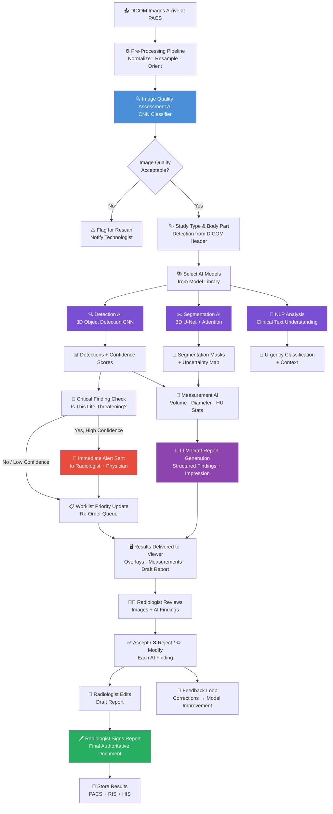

### AI Confidence and Decision Sequence

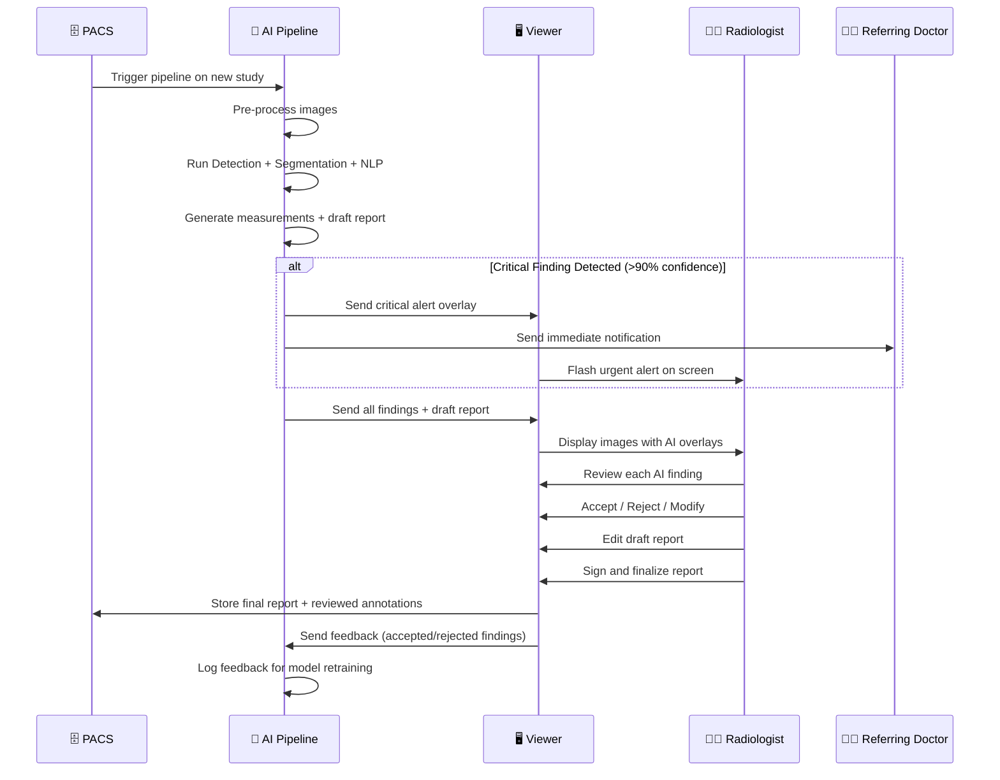

---

## 8. AI Models Used — Summary Table

| Function | AI Model Type | Simple Description |
|----------|--------------|-------------------|
| Image Quality | CNN Classifier | Checks if images are good enough to read. |
| Detection | 3D CNN Object Detector (RetinaNet variant) | Finds and locates abnormal findings in 3D. |
| Segmentation | 3D U-Net + Attention Gates | Precisely outlines organs and lesions voxel-by-voxel. |
| Uncertainty | Monte Carlo Dropout | Estimates how confident the AI is, pixel by pixel. |
| Prioritization | Multi-modal Classifier (CNN + NLP fusion) | Decides which cases need urgent attention. |
| Measurement | Rule-based + AI-assisted geometry | Calculates distances, volumes, densities from masks. |
| Report NLP | Radiology LLM (fine-tuned) | Turns AI findings into human-readable report text. |
| Critical Alert | Threshold-based + Classification CNN | Detects immediately dangerous findings. |

---

## 9. Technologies Used

| Technology | Simple Explanation |
|------------|-------------------|
| **CNN (Convolutional Neural Network)** | An AI model that learns visual patterns from images — the foundation of all image-based AI tasks. |
| **3D U-Net** | A CNN designed specifically for segmenting 3D volumes like CT and MRI scans. |
| **Attention Mechanism** | A part of the AI model that learns which areas of the image are most important to focus on. |
| **Monte Carlo Dropout** | A technique to measure the AI's uncertainty by running the model multiple times with slight random variations. |
| **LLM (Large Language Model)** | An AI model trained on large amounts of text; used here for generating natural language radiology reports. |
| **NLP (Natural Language Processing)** | AI technology for understanding and generating human language — used for clinical text analysis and report writing. |
| **PyTorch** | The leading open-source AI framework used to train and run our deep learning models. |
| **ONNX Runtime** | A standardised format for deploying trained AI models in production systems, regardless of which framework was used to train them. |
| **NVIDIA CUDA / GPU Computing** | The hardware and software layer that allows AI models to run at high speed using graphics cards. |
| **DICOM SR / SEG / PR** | Standard formats for storing AI results (reports, segmentation masks, presentation states) in PACS. |
| **HL7 FHIR** | A standard for exchanging clinical information (like AI-generated alerts) between hospital systems. |

---

## 10. Benefits

### Benefits for Radiologists
- Significant reduction in reading time for routine studies.
- AI acts as a second pair of eyes — reducing the risk of missed findings.
- Draft reports eliminate the blank-page problem in report generation.
- Uncertainty maps tell them exactly where to focus their review effort.

### Benefits for Hospitals
- Higher patient throughput without increasing radiologist headcount.
- Reduced costs per study.
- Consistent, auditable AI decisions that support regulatory compliance.
- Continuous model improvement as AI learns from radiologist feedback.

### Benefits for Patients
- Faster diagnosis — especially critical for time-sensitive conditions.
- More consistent measurements — better treatment planning.
- Reduced risk of missed findings.
- Clearer reports with structured, comprehensive findings.

### Benefits for Referring Physicians
- Faster report turnaround.
- Structured, machine-readable reports that integrate with their EMR.
- Immediate critical finding alerts.

---

## 11. Summary

AI in our Enterprise PACS + DICOM system is not a single feature — it is a deeply integrated, end-to-end intelligence layer that enhances every step of the imaging workflow. From checking image quality when a scan first arrives, to detecting critical life-threatening findings within seconds, to segmenting organs with voxel-level precision, to generating a draft radiology report — AI works quietly alongside the radiologist to make the entire process faster, more accurate, and more consistent. Crucially, the radiologist always has final authority: AI is a powerful assistant, never a replacement. Every AI decision is logged and every radiologist correction feeds back into model improvement, creating a system that learns and gets better with every scan it processes.

---

---

<a name="question-5"></a>
# Question 5
## Secure Sharable Study Link Feature

---

## 1. Overview

### What Is This?

In a traditional hospital setup, medical images are locked inside the hospital's own network. If a referring physician, a specialist at another hospital, or a patient wants to view images, they must either physically visit the hospital, be given a PACS login account (which is expensive and time-consuming to manage), or receive a CD/DVD with images on it (which is slow and outdated).

Our system introduces a **Secure Sharable Study Link** feature. This allows an authorised user — such as a radiologist or PACS administrator — to generate a special web link (a URL) for a specific patient's study. That link can then be shared with anyone — a specialist, a surgeon, or even a patient — who can click it and instantly view the medical images in a web browser, without needing a PACS account.

Think of it like a secure, time-limited Google Drive link — but for medical images, with strict security controls.

### Why Is It Needed?

| Problem Without Sharable Links | How Our Feature Solves It |
|-------------------------------|---------------------------|
| Specialists at other hospitals cannot view images remotely. | A sharable link lets them view instantly from any browser. |
| Managing full PACS user accounts for every external consultant is costly. | No account is needed — the link itself is the access credential. |
| CDs and USB drives are slow, can be lost, and may carry viruses. | Links are instant, digital, and expire automatically. |
| No control over who can access shared images or for how long. | Links can be password-protected and set to expire at a chosen time. |
| No record of who viewed the images and when. | Every access is recorded in a secure audit log. |
| Referring physicians wait days for CDs to arrive by courier. | Specialists receive the link immediately via email or message. |

### Where Is It Used?

- **Teleconsultation** — sharing images with a specialist at a different hospital.
- **Multidisciplinary Team (MDT) meetings** — distributing images to multiple team members before a case conference.
- **Patient access** — giving patients a link to view their own scan results.
- **Second opinions** — sending images to another radiologist for review.
- **Emergency handover** — quickly sharing critical images with an on-call doctor before they arrive at the hospital.

---

## 2. What Is Happening?

### Simple Explanation

Imagine the PACS system is like a secure vault containing all patient images. Normally, only people with a vault key (a PACS account) can access it.

The Sharable Link feature works like a **temporary, single-purpose copy of the key**:

1. A radiologist or administrator creates a share link for one specific patient study.
2. The system generates a unique, random secret code (the **token**) and builds it into a web link.
3. That link is given to the recipient (e.g., emailed to a specialist).
4. When the specialist clicks the link, the system:
   - Checks the secret code is valid.
   - Checks it has not expired.
   - Checks it has not been revoked.
   - Optionally asks for a password.
   - If everything checks out, displays the images in the browser.
5. Every access — including failed attempts — is automatically logged.

The link works like a **one-time or time-limited key** — it can be set to expire after 24 hours, 7 days, or any duration. Once expired, the link stops working permanently.

---

## 3. How Is It Happening?

### Step-by-Step Breakdown

#### Step 1 — Radiologist Selects a Study to Share

In the PACS Study Browser (the web interface where radiologists manage studies), the radiologist selects a patient's study. In the Study Detail panel on the right side of the screen, they click a **"Share Study"** button (or equivalent action).

#### Step 2 — Share Configuration Dialog

A dialog (popup window) appears where the radiologist configures the sharing parameters:

- **Permissions** — what the recipient is allowed to do:
  - **View** — can the recipient see the images? (default: Yes)
  - **Measure** — can the recipient use measurement tools? (default: Yes)
  - **Annotate** — can the recipient add annotations/notes? (default: No)
  - **Download** — can the recipient download the DICOM files? (default: No)
- **Expiration Date** — when should the link stop working? (e.g., 24 hours, 7 days, custom date)
- **Password Protection** — optionally set a password that the recipient must enter before viewing.
- **Created By** — who is generating this link (for audit purposes).

#### Step 3 — Backend Token Generation

When the radiologist confirms the share settings, the frontend sends a request to the backend API:

```
POST /api/share-study
{
  study_uid: "1.2.840.10008.5.1.4.1...",
  permissions: { view: true, measure: true, annotation: false, download: false },
  expires_at: "2026-08-01T14:00:00Z",
  password: "optional-password",
  created_by: "dr.smith"
}
```

The backend then:

1. **Verifies the study exists** in the local PACS database (so a link cannot be created for a non-existent study).
2. **Validates the expiration date** — it must be in the future.
3. **Hashes the password** (if provided) using **PBKDF2** — a strong cryptographic hashing algorithm (explained below).
4. **Generates a cryptographically secure random token** — a unique 32-character hexadecimal string (e.g., `a7f3c82d9b...`). This is generated using `crypto.randomBytes()`, which draws from the operating system's secure random number generator — making it practically impossible to guess.
5. **Saves a record** to the secure cloud database (Supabase/PostgreSQL) containing:
   - The token
   - The Study UID
   - The permissions
   - The hashed password
   - The expiration timestamp
   - The creator's identity
   - The creation timestamp
   - A `revoked = false` flag

> 💡 **What is PBKDF2?**
> PBKDF2 (Password-Based Key Derivation Function 2) is a secure method of storing passwords. Instead of storing the actual password (which is dangerous if the database is ever breached), the system runs the password through a mathematical function 10,000 times and stores the result. When someone enters a password, the same process is run and the result is compared. The real password is never stored anywhere.

#### Step 4 — Share URL Returned to Radiologist

The backend returns the full shareable URL to the frontend:

```
https://pacs-dicom.vercel.app/share/a7f3c82d9b4e1f2a3b...
```

This URL is displayed on screen. The radiologist can:
- Copy it and send it via email, messaging app, or any communication channel.
- The system may also optionally provide a QR code for easy mobile sharing.

#### Step 5 — Recipient Accesses the Link

When the specialist (recipient) clicks the link:

1. Their browser opens the frontend application at the share URL.
2. The frontend reads the token from the URL.
3. The frontend sends a validation request to the backend:
   ```
   GET /api/share/:token
   ```
4. The backend performs a series of checks (described in Step 6).
5. If all checks pass, the backend returns the Study UID and permissions.
6. The frontend uses the Study UID to load the images from PACS and open the viewer — automatically, with no further user action required.

#### Step 6 — Token Validation (Security Checks)

The backend runs every check in order. If any check fails, access is denied and the failure is logged:

| Check # | What Is Checked | What Happens If It Fails |
|---------|----------------|-------------------------|
| 1 | Does the token exist in the database? | 404 Not Found returned. |
| 2 | Has the link been revoked? | 403 Forbidden returned. |
| 3 | Has the link expired (current time > expiry time)? | 403 Forbidden returned. Audit logged as EXPIRE. |
| 4 | Is a password required? (If yes, was it provided?) | 401 Password Required returned. |
| 5 | If password provided, does it match the stored hash? | 401 Invalid Password returned. Audit logged. |
| ✅ All pass | Access granted. | Last accessed timestamp updated. Audit logged as OPEN. |

#### Step 7 — Granular Permission Enforcement

Once the viewer loads via a share link, it operates in a **restricted mode** based on the permissions stored with the token:

- If `measure = false` → measurement tools are hidden/disabled.
- If `annotation = false` → annotation tools are hidden/disabled.
- If `download = false` → the download button is hidden; DICOM file access is blocked at the API level.
- If `view = true` → images are displayed normally.

This ensures the link creator has complete control over what the recipient can and cannot do.

#### Step 8 — Audit Logging

Every significant event related to a share link is automatically recorded in the audit log database:

| Event | When Recorded |
|-------|---------------|
| `CREATE` | When the share link is first generated. |
| `OPEN` | Every time someone successfully accesses the link. |
| `OPEN` (failed) | When a wrong password is entered or a revoked link is accessed. |
| `EXPIRE` | When an expired link is accessed. |
| `REVOKE` | When the link is manually revoked by an administrator. |
| `UPDATE_PERMISSIONS` | When permissions are changed after creation. |
| `UPDATE_EXPIRATION` | When the expiry date is changed. |
| `UPDATE_PASSWORD` | When the password is changed. |
| `DELETE` | When the link record is permanently deleted. |

Each audit log entry records:
- The token
- The Study UID
- The action performed
- The **IP address** of the person accessing the link
- The **browser** they used (Chrome, Firefox, Safari, Edge, etc.)
- The **device type** (Windows PC, iPhone, iPad, Android Phone, etc.)
- The **timestamp**

#### Step 9 — Link Management

Administrators can view a full list of all active share links at:
```
GET /api/share/list
```

This returns for each link:
- Patient name and ID (joined from the local PACS database)
- Study description
- Permissions granted
- Expiration date
- Creation date
- Last accessed date
- Whether it is revoked
- Whether it is password-protected

Administrators can then:
- **Update** a link (change permissions, expiry, or password): `PATCH /api/share/:token`
- **Revoke** a link (soft delete — disables it but keeps the audit record): `DELETE /api/share/:token`
- **Hard delete** a link (permanently removes it): `DELETE /api/share/:token?hard=true`
- **View full audit history** for a specific token: `GET /api/share/:token/audit`

---

## 4. AI Involvement

AI is **not directly involved** in the Share Link feature itself. The share link system is a security and access-control feature.

However, there is an indirect AI connection:
- When a recipient opens a shared study link and views images in the browser, the same AI-powered overlays, AI-suggested annotations, and AI-generated report drafts that were created during the radiologist's review session are visible to the recipient (subject to the permissions granted).
- This means a remote specialist receives not just raw images, but AI-annotated images with measurements and highlighted findings — greatly improving the quality of remote consultations.

---

## 5. Complete Workflow

1. Radiologist selects a patient study in the PACS Study Browser.
2. Radiologist clicks "Share Study" and configures permissions, expiry, and optional password.
3. Frontend sends `POST /api/share-study` to the backend.
4. Backend verifies the study exists in the PACS database.
5. Backend validates expiration date (must be future).
6. Backend hashes the password using PBKDF2 (if provided).
7. Backend generates a cryptographically secure 32-byte random token.
8. Backend saves share record to Supabase (PostgreSQL) cloud database.
9. Backend logs `CREATE` action in audit table with IP, browser, device.
10. Backend returns full shareable URL to the frontend.
11. Radiologist copies and sends the URL to the recipient.
12. Recipient clicks the URL in their browser.
13. Frontend reads the token from the URL.
14. Frontend sends `GET /api/share/:token` to the backend.
15. Backend checks: token exists → not revoked → not expired → password correct.
16. If any check fails → access denied + audit log written.
17. If all checks pass → backend returns Study UID + permissions.
18. Backend logs `OPEN` action in audit table.
19. Backend updates `last_accessed` timestamp on the share record.
20. Frontend loads images from PACS using the Study UID.
21. Viewer opens in restricted mode, enforcing the granted permissions.
22. Recipient can view/measure/annotate (within their permissions).
23. Administrator can monitor, update, or revoke links at any time.

---

## 6. Flow Diagrams

### Sharable Link Creation Flowchart

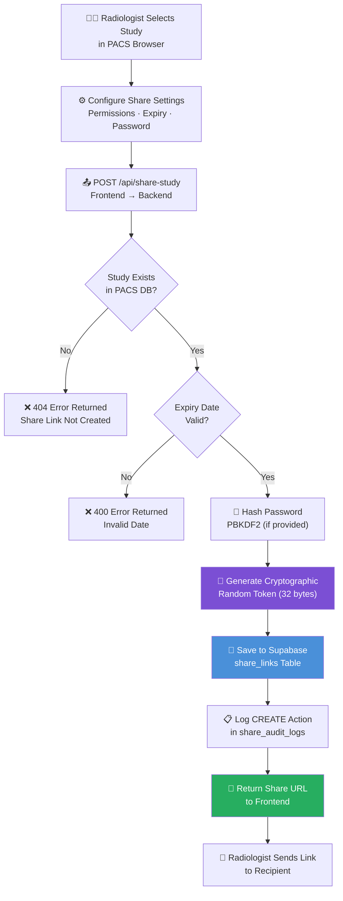

### Sharable Link Access Flowchart

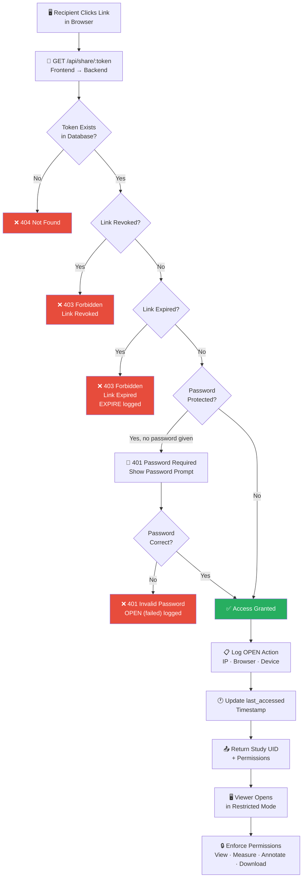

### Sequence Diagram — Full Share Link Lifecycle

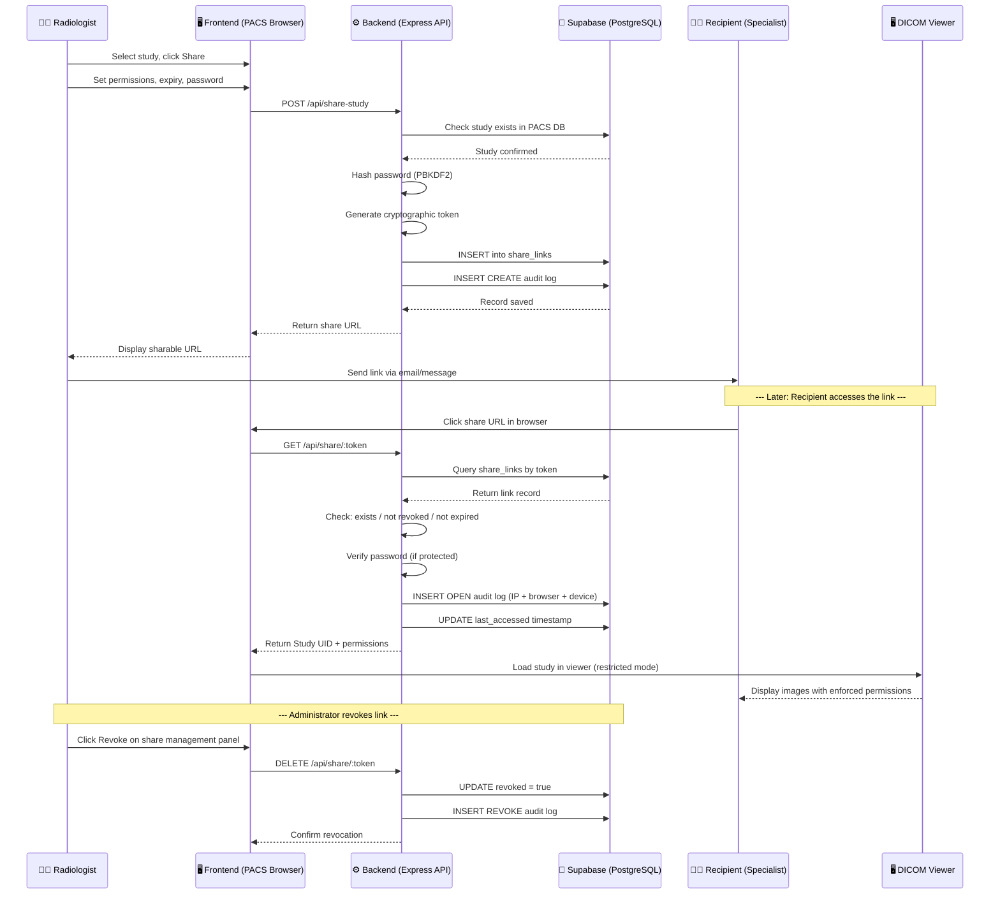

---

## 7. Database Schema

The system uses two database tables stored in Supabase (a cloud-hosted PostgreSQL database):

### Table 1 — `share_links`

Stores one record per share link created.

| Column | Data Type | Description |
|--------|-----------|-------------|
| `id` | UUID | Unique identifier for this record (auto-generated). |
| `token` | Text (unique) | The cryptographic random token embedded in the share URL. |
| `study_uid` | Text | The DICOM Study Instance UID of the shared study. |
| `sharing_scope` | Text | Currently always `STUDY` (full study sharing). |
| `permissions` | JSON | Object containing `view`, `measure`, `annotation`, `download` booleans. |
| `password_hash` | Text (nullable) | PBKDF2 hashed password. Null if no password set. |
| `expires_at` | Timestamp (nullable) | When the link expires. Null = never expires. |
| `created_by` | Text | Who created the link (user ID or name). |
| `created_at` | Timestamp | When the link was created. |
| `updated_at` | Timestamp | Last time any field was changed. |
| `last_accessed` | Timestamp (nullable) | Last time someone successfully opened the link. |
| `revoked` | Boolean | Whether the link has been manually disabled. |

### Table 2 — `share_audit_logs`

Stores one record for every significant access event.

| Column | Data Type | Description |
|--------|-----------|-------------|
| `id` | UUID | Unique identifier for this audit record. |
| `share_token` | Text | The token this event relates to. |
| `study_uid` | Text | The study being accessed. |
| `action` | Text (enum) | One of: CREATE, OPEN, REVOKE, EXPIRE, DELETE, UPDATE_PERMISSIONS, UPDATE_PASSWORD, UPDATE_EXPIRATION. |
| `ip_address` | Text | IP address of the accessor. |
| `device` | Text | Device type (Windows PC, iPhone, etc.). |
| `browser` | Text | Browser name (Chrome, Firefox, etc.). |
| `created_at` | Timestamp | When this audit event occurred. |

> [!IMPORTANT]
> The `password_hash` column in `share_links` is **never returned to the frontend** in any API response. The backend sanitises all responses to ensure passwords are never exposed, even in their hashed form.

---

## 8. Security Design

The sharable link system was designed with a **defence-in-depth** security approach — multiple independent layers of protection:

| Security Layer | Implementation |
|---------------|----------------|
| **Token unguessability** | 32-byte cryptographically random hex token = 2^256 possible values. Practically impossible to brute-force. |
| **HTTPS enforcement** | All links served over HTTPS (Nginx with SSL). Token never transmitted in plaintext. |
| **Password protection** | Optional PBKDF2 password hash with random salt. 10,000 iterations. Never stored in plaintext. |
| **Expiry enforcement** | Server-side expiry check on every access. Client cannot bypass by manipulating a local cookie or timestamp. |
| **Revocation** | Immediate server-side revocation. Once revoked, the token is permanently blocked regardless of expiry date. |
| **Rate limiting** | API rate limiter prevents brute-force guessing of tokens or passwords. |
| **Audit trail** | Every access — including failed attempts — is logged with IP, browser, device, and timestamp. |
| **Permission enforcement** | Permissions enforced both on the frontend (UI elements hidden) and backend (API blocks disallowed actions). |
| **Password never exposed** | API responses never include `password_hash`. Only the token, permissions, and metadata are returned. |
| **Configurable global limit** | `MAX_SHARE_LINKS` environment variable caps total active links (default: 1,000) to prevent storage abuse. |

---

## 9. Technologies Used

| Technology | Simple Explanation |
|------------|-------------------|
| **Node.js / Express** | The backend web server that handles all share link API requests. |
| **TypeScript** | A safer, strongly typed version of JavaScript used to write the backend and frontend code. |
| **Supabase (PostgreSQL)** | A cloud-hosted database where all share link records and audit logs are stored persistently. |
| **PBKDF2 (via Node.js crypto)** | A strong cryptographic algorithm for securely hashing passwords so they are never stored in plaintext. |
| **crypto.randomBytes()** | Node.js built-in function for generating cryptographically secure random tokens. |
| **React (Frontend)** | The JavaScript framework used to build the PACS Study Browser interface where share links are created. |
| **Nginx (Reverse Proxy)** | Sits in front of the Node.js server in production; handles SSL (HTTPS) and forwards requests. |
| **Vercel (Cloud Hosting)** | The cloud platform hosting the frontend application (the share viewer) at `pacs-dicom.vercel.app`. |
| **REST API** | The communication standard between the frontend and backend — all share link operations use standard HTTP methods (GET, POST, PATCH, DELETE). |

---

## 10. Comparison with Prior Art

Most traditional PACS systems do not offer any native sharable link functionality. The common existing alternatives are:

| Method | Problems |
|--------|----------|
| **Physical CD/DVD** | Slow to produce, can be lost or damaged, no access control, no audit trail. |
| **External PACS account** | Requires manual account creation, password management, ongoing IT overhead. |
| **Email attachment (ZIP of DICOM)** | DICOM files are large; email is insecure; no access control once sent. |
| **VPN access to hospital network** | Complex to set up for external users; requires IT support; security risk. |
| **Third-party image sharing platforms** | Require separate subscriptions; images must be re-uploaded; break the workflow. |

**Our Innovation:** All of the above require either significant IT overhead or sacrifice security and audit accountability. Our integrated sharable link system provides:

- **Zero account management** — links are self-contained credentials.
- **Granular, per-link permissions** — different specialists can receive different levels of access.
- **Automatic expiry** — no cleanup required; links deactivate themselves.
- **Full audit trail built-in** — every access recorded for compliance.
- **Seamless PACS integration** — the link opens directly inside the same DICOM viewer used by radiologists, with full AI annotations and measurements visible.
- **Works from any browser** — no software installation required on the recipient's device.

---

## 11. Benefits

| Beneficiary | Benefit |
|-------------|----------|
| **Radiologist** | Share images with one click; no CD burning, no IT tickets. |
| **Referring Physician** | Receives images within seconds; views them from any browser. |
| **Remote Specialist** | Full viewer access including AI annotations and measurements without needing a PACS account. |
| **Patient** | Can receive a link to view their own scan results with a simple click. |
| **Hospital Administrator** | Full audit trail for compliance; immediate revocation if a link is shared inappropriately. |
| **IT Department** | No user account provisioning required for external access. |
| **Compliance Officer** | Every access logged with IP, browser, device — satisfies medical record access audit requirements. |

---

## 12. Summary

The Secure Sharable Study Link feature solves a long-standing problem in medical imaging: how do you share a patient's scan with someone outside the hospital network, quickly, safely, and in a way that gives you full control and accountability? Our system generates a cryptographically secure, uniquely random web link for any study stored in PACS. The link can be password-protected, set to expire automatically, and restricted to only the permissions the creator wants to grant (view-only, or view plus measure, etc.). Every access — successful or failed — is recorded in a tamper-evident audit log with the accessor's IP address, browser, and device. This is a fully integrated, zero-IT-overhead solution that works from any modern web browser, with no software installation or account creation required on the recipient's side. It is a significant innovation over all existing PACS sharing methods.

---

---

## Document End

**Document Version:** 1.1
**Total Questions Answered:** 5
**Diagrams Included:** 11 Mermaid diagrams (7 flowcharts, 4 sequence diagrams)

> [!NOTE]
> All technical terms are explained in plain language throughout this document. Mermaid diagrams are provided for each major workflow. This document is intended to be read alongside the patent drawings and claims package for the Enterprise PACS + DICOM System invention disclosure.

---

*End of Invention Disclosure Form — Technical Description Document*
*Enterprise PACS + DICOM System — AI-Assisted Medical Imaging Platform*
