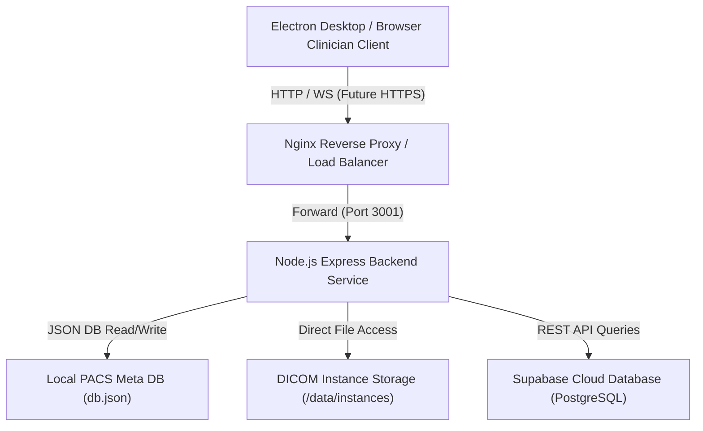

# MedView Pro - Production Deployment & Hardening Guide

This document provides deployment guidelines, system configuration specifications, security policies, backup routines, and architecture specifications for hospital LAN, VPN, and enterprise installations of MedView Pro.

---

## 1. System Architecture

Below is the deployment block diagram for hospital setups:



---

## 2. Environment Configurations

Configure these environment variables in your server configuration file (e.g. `.env` file):

| Variable Name | Description | Production Default |
|:---|:---|:---|
| `NODE_ENV` | Mode of operation | `production` |
| `SERVER_HOST` | Host address to bind the service to | `0.0.0.0` (all interfaces) |
| `PORT` | API Server listening port | `3001` |
| `SHARE_BASE_URL` | Base URL matching the frontend application launcher | `http://localhost:3000` |
| `SUPABASE_URL` | Supabase endpoint URL | `https://your-proj.supabase.co` |
| `SUPABASE_ANON_KEY` | Supabase Anon database client key | `your-anon-key` |
| `SUPABASE_SERVICE_ROLE_KEY` | Server-side query authentication bypass key | `your-service-role-key` |
| `MAX_SHARE_LINKS` | Max active share links permitted globally | `5000` |
| `LOG_LEVEL` | Logging verbosity (`DEBUG`, `INFO`, `WARN`, `ERROR`) | `INFO` |
| `LOG_RETENTION_DAYS` | Daily rotated log file retention period (in days) | `30` |

---

## 3. Deployment & Process Management

### PM2 Clustering
For production auto-restart recovery, load balancing across CPU cores, and log mergings, use PM2:

1. **Install PM2 globally on the host**:
   ```bash
   npm install pm2 -g
   ```
2. **Start the backend application in cluster mode**:
   ```bash
   pm2 start ecosystem.config.js
   ```
3. **Configure PM2 auto-restart on system bootup**:
   ```bash
   pm2 startup
   pm2 save
   ```

### Reverse Proxy & SSL (HTTPS)
Do not expose the Express Node service directly to the outer hospital network. Configure an Nginx reverse proxy to handle SSL termination:

```nginx
server {
    listen 443 ssl http2;
    server_name dicom.hospital-lan.local;

    ssl_certificate /etc/ssl/certs/hospital_pacs.crt;
    ssl_certificate_key /etc/ssl/private/hospital_pacs.key;

    location / {
        proxy_pass http://127.0.0.1:3001;
        proxy_http_version 1.1;
        proxy_set_header Upgrade $http_upgrade;
        proxy_set_header Connection 'upgrade';
        proxy_set_header Host $host;
        proxy_cache_bypass $http_upgrade;
        proxy_set_header X-Forwarded-For $proxy_add_x_forwarded_for;
        proxy_set_header X-Forwarded-Proto $scheme;
    }
}
```

---

## 4. API Reference Manual

| Endpoint | Method | Security Checks | Description |
|:---|:---|:---|:---|
| `/api/health` | `GET` | None | System uptime, CPU, memory usage, and database/storage connection checks. |
| `/api/share-study` | `POST` | Input Validator, Rate Limiter | Generates a secure share link for a study. |
| `/api/share/:token` | `GET` | Password Prompt, Expiry checks | Validates share links and returns study references. |
| `/api/admin/backup` | `GET` | Server Admin role | Backup share metadata and logs to JSON. |
| `/api/admin/restore` | `POST` | Server Admin role | Restores Supabase data from a JSON payload or local file. |

---

## 5. Backup & Disaster Recovery Guide

### Backup Share Metadata
To generate a timestamped backup of your active share links and logs without fetching raw DICOM images, query the backup utility:
```bash
curl -X GET http://localhost:3001/api/admin/backup
```
This saves a copy under `data/backups/backup-{timestamp}.json` and returns the database records in JSON.

### Restore Database
To restore sharing data from a local backup file, run:
```bash
curl -X POST http://localhost:3001/api/admin/restore \
     -H "Content-Type: application/json" \
     -d '{"file": "backup-1715609421.json"}'
```

### Disaster Recovery Scenarios

#### Scenario A: Supabase Connection Drop
- **Status Indicator**: `/api/health` returns `supabase: "offline"`.
- **System Action**: Workstation clients will switch to local cache reads. Creating new links will fail gracefully showing Toast error notices. Viewing existing PACS studies locally is **unaffected**.
- **Resolution**: Verify port `443` outbound access to Supabase IP ranges from the local server.

#### Scenario B: Storage Offline
- **Status Indicator**: `/api/health` returns `storage: "unhealthy"`.
- **System Action**: Block study imports and upload processes.
- **Resolution**: Check server disk partition space and verify write permissions to the `/data/instances` storage directory.
